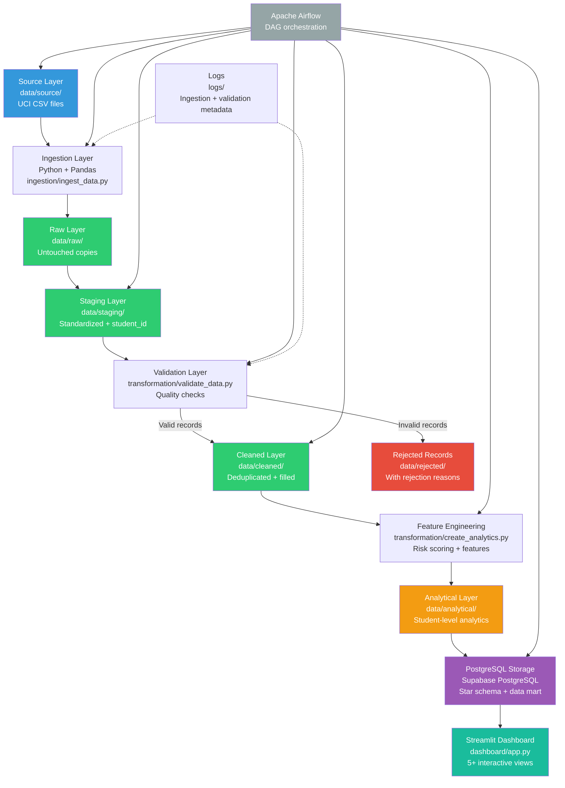
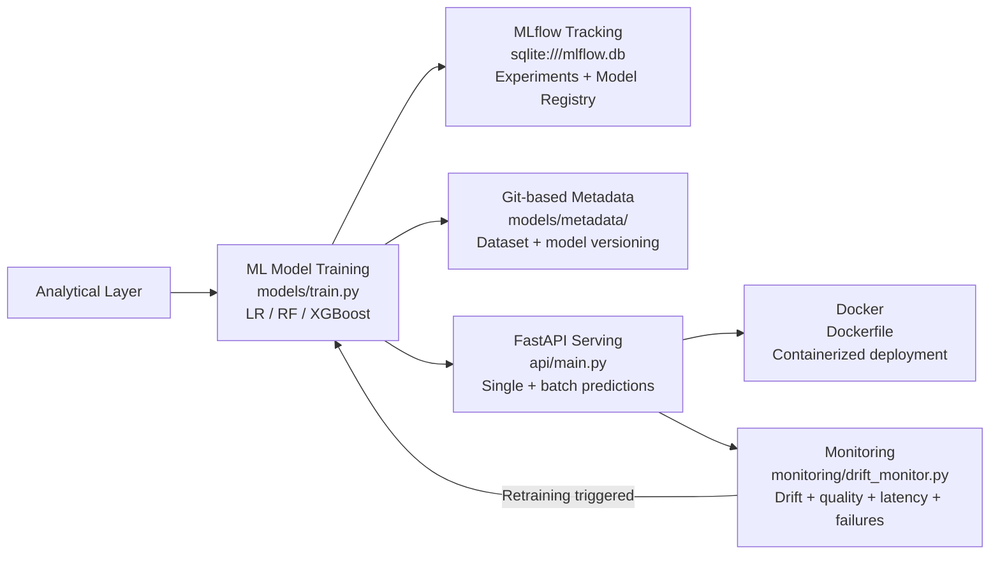

# Architecture Documentation

## Overview

The Student Performance and Dropout-Risk Prediction project implements a
complete data engineering pipeline (Part 1) and MLOps pipeline (Part 2) that
processes student academic records from the UCI Student Performance dataset,
creates reliable analytical datasets, trains ML models for dropout-risk
prediction, serves them via FastAPI, and monitors them in production.

## Architecture Diagram (Mermaid)

## Layer Descriptions

### 1. Source Layer
- **Location**: `data/source/`
- **Contents**: Original UCI CSV files (`student-mat.csv`, `student-por.csv`)
- **Format**: Semicolon-delimited CSV with 33 columns per file

### 2. Ingestion Layer
- **Module**: `ingestion/ingest_data.py`
- **Function**: Reads CSV files from source, copies them untouched to raw layer
- **Metadata**: Logs every ingestion attempt to `logs/ingestion_metadata.csv`
- **Error Handling**: If one file fails, logs the error and continues with others

### 3. Raw Layer
- **Location**: `data/raw/`
- **Contents**: Byte-for-byte copies of source files
- **Rule**: Never modified — preserves original data for auditability

### 4. Staging Layer
- **Location**: `data/staging/`
- **Module**: `transformation/stage_data.py`
- **Transformations**:
  - Column names standardized (lowercased, stripped)
  - Data types standardized (numeric columns coerced to Int64)
  - Reproducible `student_id` generated via SHA-256 hash
  - `subject` column added (Math or Portuguese)

### 5. Validation Layer
- **Module**: `transformation/validate_data.py`
- **Checks**: Duplicates, missing IDs, numeric ranges, categorical values, data types
- **Outputs**: Valid records (passed to cleaning), rejected records (saved separately)
- **Report**: `logs/validation_report.csv` with per-file summary

### 6. Cleaned Layer
- **Location**: `data/cleaned/`
- **Module**: `transformation/clean_data.py`
- **Operations**: Deduplication, missing value imputation, type correction
- **Output**: Per-subject files + combined `student_all_cleaned.csv`

### 7. Rejected Records
- **Location**: `data/rejected/rejected_records.csv`
- **Contents**: Invalid rows with rejection reason, source file, and timestamp
- **Rule**: Never manually edited

### 8. Analytical Layer
- **Location**: `data/analytical/student_analytics.csv`
- **Module**: `transformation/create_analytics.py`
- **Features**: Engineered columns (academic_average, attendance_pct, pass_fail, risk_score, risk_category)
- **Risk**: Rule-based categorization (Low/Medium/High) — used as the ML training target in Part 2

### 9. PostgreSQL Storage Layer
- **Database**: Supabase PostgreSQL
- **Schema**: Star-schema-inspired design
  - `dim_student` — student dimension (666 unique students)
  - `dim_subject` — subject dimension (Math, Portuguese)
  - `fact_student_performance` — per-student per-subject grades
  - `student_performance_analytics` — analytical data mart
  - `pipeline_metadata_log` — pipeline execution tracking
- **Loading**: Idempotent upserts (ON CONFLICT) to avoid duplicates on re-runs

### 10. Streamlit Dashboard
- **Module**: `dashboard/app.py`
- **Data Source**: PostgreSQL analytics table (with CSV fallback)
- **Views**:
  1. Overall Performance Overview (KPIs)
  2. Attendance vs Performance scatter plot
  3. Performance Distribution (pass/fail pie, grade histogram)
  4. Risk Analysis (risk bar chart, failures by risk)
  5. Student-Level Analysis (search, filter, detail view)
  6. ML Risk Prediction (Part 2) — single + batch predictions with probability

### 11. Apache Airflow Orchestration
- **DAG**: `airflow/dags/student_performance_pipeline.py`
- **Schedule**: Daily at 2:00 AM (demonstration)
- **Tasks**: 12 tasks (9 Part 1 + 3 Part 2) with linear dependencies
- **Retries**: 2 retries with 1-minute delay
- **Reuse**: Calls existing Python functions — no duplicated logic

## MLOps Layer (Part 2 — Implemented)

### 12. ML Model Training
- **Module**: `models/train.py`
- **Models**: Logistic Regression (baseline), Random Forest, XGBoost (advanced)
- **Target**: `at_risk` (binary: 1 = High/Medium Risk, 0 = Low Risk)
- **Split**: 60/20/20 train/val/test, stratified, random_state=42
- **Selection**: Best model by validation F1-score
- **Current production model**: XGBoost (val_f1=0.9565, test_f1=0.9444)

### 13. MLflow Tracking + Model Registry
- **Backend**: SQLite (`sqlite:///mlflow.db`)
- **Experiment**: `student_risk_prediction`
- **Registry**: Best model registered as `student_risk_model` with `stage=production` tag
- **Artifacts**: Model, scaler, classification reports logged per run

### 14. Git-Based Dataset/Model Versioning
- **Model metadata**: `models/metadata/model_metadata.json`
- **Dataset metadata**: `models/metadata/dataset_metadata.json` (SHA256 hash)
- **Training profile**: `models/metadata/training_profile.json` (feature stats for drift)
- DVC is not used; Git-based metadata provides reproducible versioning

### 15. FastAPI Model Serving
- **Module**: `api/main.py`
- **Endpoints**: `/predict`, `/predict-batch`, `/model-info`, `/`
- **Validation**: Pydantic models with field constraints (age, grades, etc.)
- **Artifacts**: Loads joblib model from `models/artifacts/`

### 16. Docker Containerization
- **File**: `Dockerfile`
- **Base**: `python:3.12-slim`
- **Port**: 8000
- **Command**: `uvicorn api.main:app --host 0.0.0.0 --port 8000`

### 17. ML Monitoring
- **Module**: `monitoring/drift_monitor.py`
- **Metrics tracked**:
  - Input quality (missing/invalid values)
  - Feature drift (numerical KS-test + categorical distribution comparison)
  - Class distribution (predicted at-risk percentage)
  - Model performance (F1 when ground truth available)
  - Latency (mean, p50, p95, p99, max)
  - Failures (error count and rate)
- **Output**: `logs/ml_monitoring_metrics.csv`
- **Safety**: Monitoring never breaks prediction (all errors caught)

### 18. Model Lifecycle + Retraining
- **Document**: `docs/mlops_lifecycle.md`
- **Retraining triggers**: feature drift, performance degradation, class shift, data update, quarterly schedule
- **Rollback**: Previous model version loaded from MLflow registry
